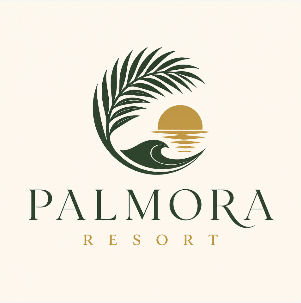

# Example customer scenario

- **Business Vertical:** Hospitality
- **About:** Palmora Resort is a tropical vacation retreat offering stylish accommodation, relaxing amenities, and memorable island-inspired experiences. Guests can book and reserve to enjoy beautiful surroundings, personalized service, dining, wellness activities, and curated adventures—all designed for a peaceful and effortless escape.
- **Business Needs:** Palmora Resort needs a solution that serves as both a calling and a light call center solution. This solution should facilitate call handling and provide easy and visual ways for supervisors to monitor agents.

## Connectivity requirements

{ width=75% }

## Users

| Department | Agents | Supervisors | Total |
| --- | ---: | ---: | ---: |
| Reservations | 3 | 1 | |
| Guest Services | 3 | 0 | |
| **Totals** | **6** | **1** | **7** |

## Call flows

{ width=75% }

Calls to the main number enter Webex Calling through the Cisco PSTN connection and are sent to the auto attendant. During business hours, callers can select Reservations, Guest Services, or the operator. The auto attendant routes callers to the appropriate queue or user experience, where agents handle the calls and supervisors can monitor them from the Webex app. After hours, callers are directed to the voicemail group.
