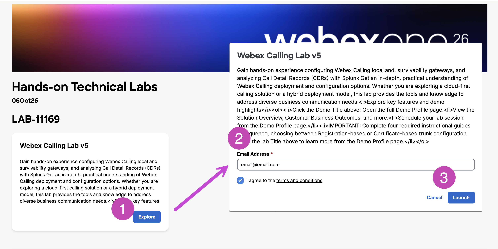
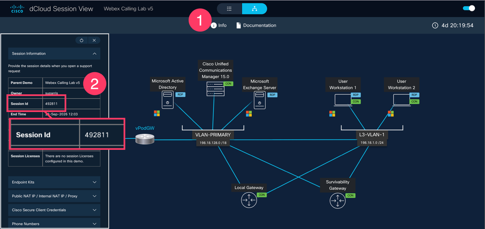
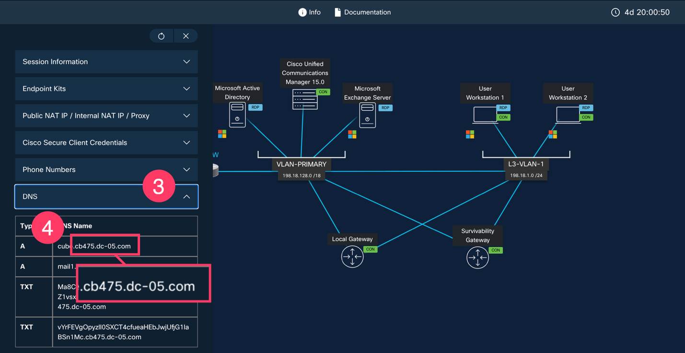

# Getting started with your environment

To access the lab environment use the following link:

<https://www.ciscodcloud.com/apps/expo/852doanwwzjba2ixk1e1q8rvh>

**Launching your environment**

{ width=60% }

1. Click Explore
2. Enter your email address and agree to the terms and conditions
3. Click Launch

**dCloud Session View**

{ width=60% }

1. In the Session View, click Info to open the left side panel
2. Copy the Session ID and paste it in any text editor available in your computer
   1. Example shown: 492811

**Domain Name**

{ width=60% }

1. Scroll down to the DNS section
   1. Click down arrow to open details if necessary
2. Copy the domain name and paste it in any text editor available in your computer
   1. Example shown: cb475.dc-05.com

**Determining administrator log in credentials**

* Administrator email format
  + cholland@cbXXX.dc-YY.com (The domain you copied above)
    - Example shown: cholland @cb375.dc-05.com
* Administrator password format
  + dCloud + last four digits of session ID + !
    - Example shown: SessionID = 492811
      * Password will be: dCloud2811!

**Logging into Collaboration Control Hub**

* In a new tab, go to [admin.webex.com](http://admin.webex.com/)
* Log in with the cholland@cbXXX.dc-YY.com credentials from above

**You are ready to begin Lab #1!**

.
