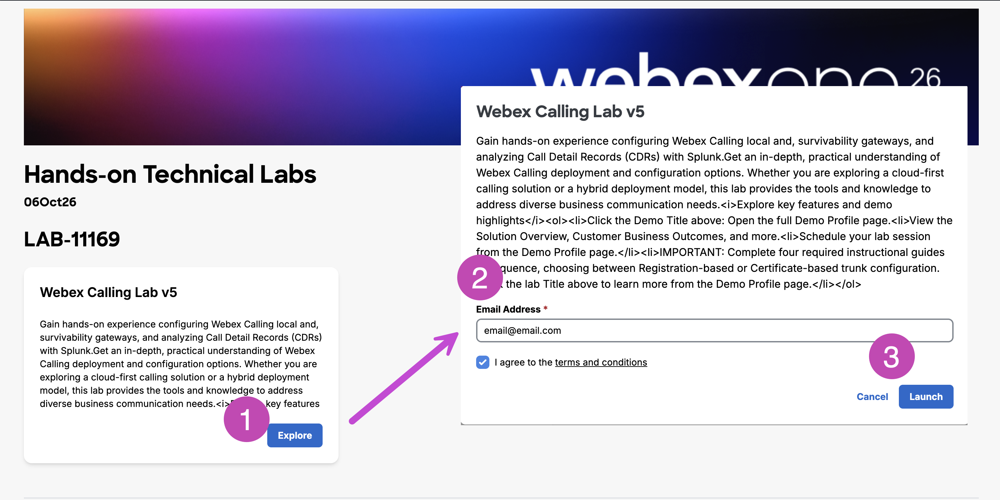
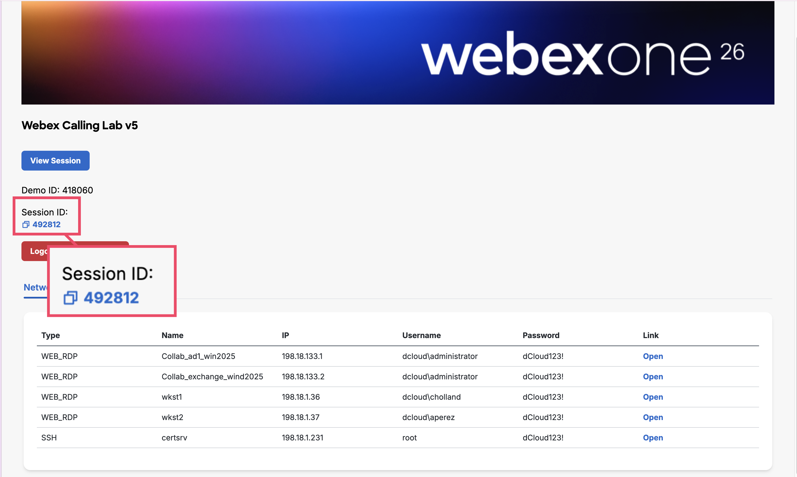
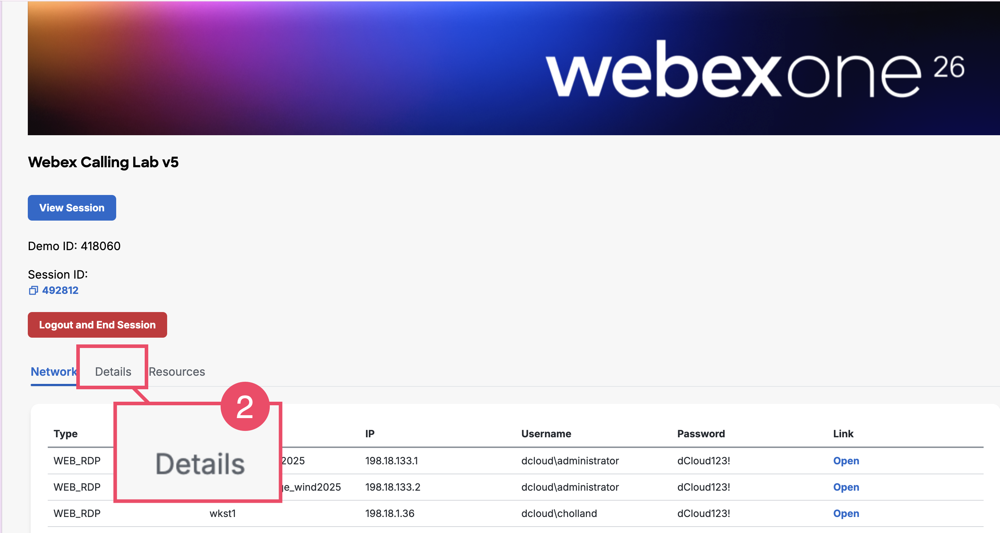
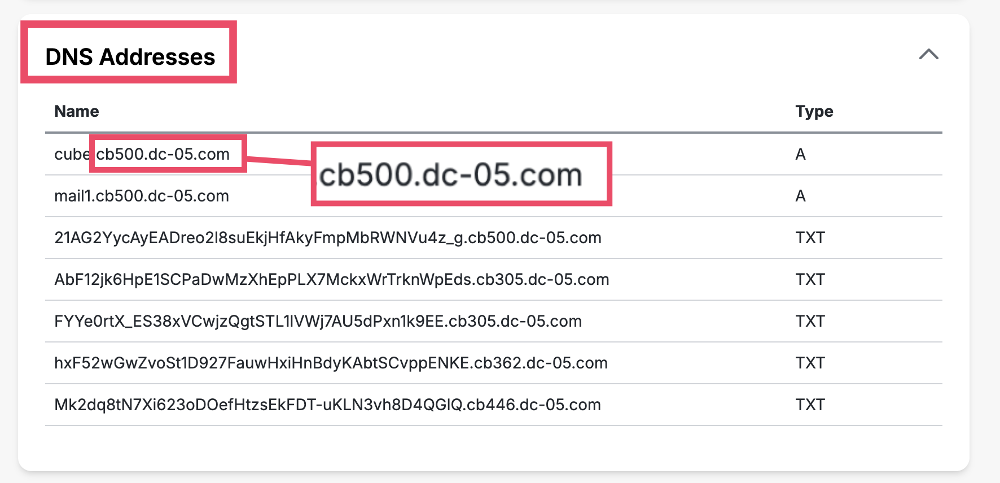

# Getting Started With Your Environment

To access the lab environment use the following link:

<https://www.ciscodcloud.com/apps/expo/852doanwwzjba2ixk1e1q8rvh>

Click images to enlarge

**Launching your environment**

{ width=60% }

1. Click Explore
2. Enter your email address and agree to the terms and conditions
3. Click Launch

**Determining your admin login credentials**

There are a couple steps to determine your credentials to Collaboration Control Hub.

{ width=60% }

- Copy the Session ID and paste it in any text editor available in your computer
    - Example shown: 492812

{ width=60% }

- Go to the Details section
   
{ width=60% }

- Scroll down to the DNS section
    - Copy the domain name for your session and paste it in any text editor available in your computer
    - Example shown: cb500.dc-05.com

**Put the details together**

Administrator email format:
- Add cholland@ to the domain you copied above
    - Example shown: cholland@cb500.dc-05.com
- Administrator password format:
  + dCloud + last four digits of session ID + !
    - Example shown: SessionID = 492812
      * Password will be: dCloud2812!

**Logging into Collaboration Control Hub**

* In a new tab, go to [admin.webex.com](http://admin.webex.com/)
* Log in with the cholland@cbXXX.dc-YY.com credentials from above

**You are ready to begin Lab #1!**

.
