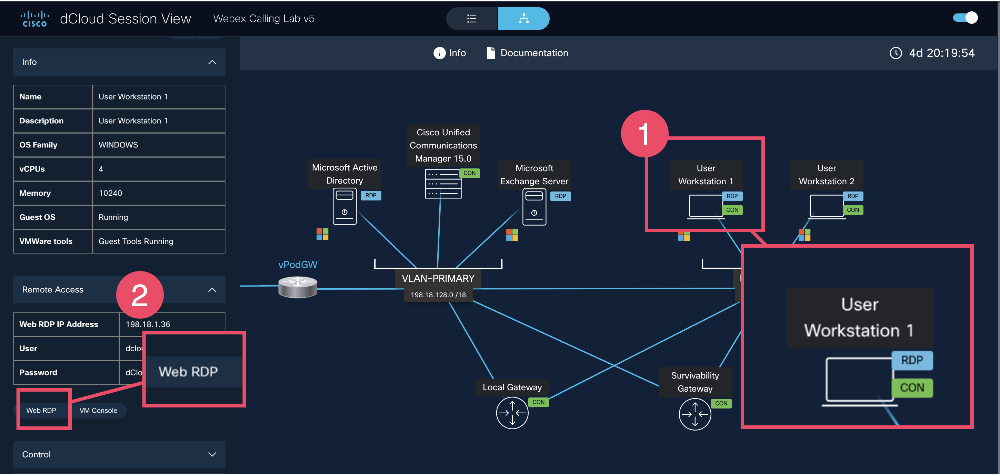
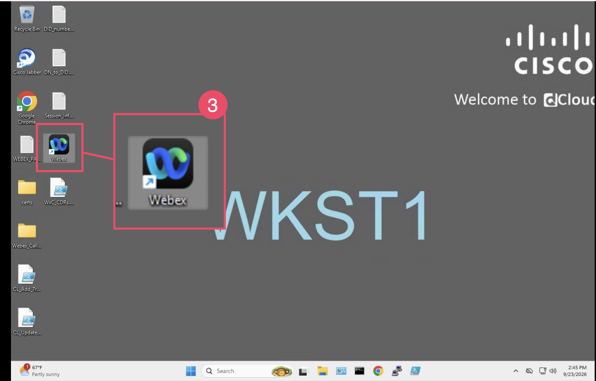

# Lab 8: Test call routing

In this lab, you will login in Webex as Charles Holland and Taylor Bard to use the Supervisor Customer Assist experience, as well as the Agent Customer Assist experience.

Go back to the dCloud Session View: <https://www.ciscodcloud.com/apps/expo/852doanwwzjba2ixk1e1q8rvh>

{ width=75% }

{ width=75% }

**1. Open User Workstation 1 and log into the Webex App as Charles Holland**

1. In your Session View, click on User Workstation 1
2. Open Remote Access on the right and click on WebRDP
3. Click on the Webex App and log in as Charles Holland
   1. Same log in as you used for Collaboration Control Hub
      1. Example: cholland @cb375.dc-05.com, dCloud1234!

**2. Open User Workstation 2 and log into the Webex App as Taylor Bard**

1. Repeate the same steps above for Workstaion 2
   1. Log in will be tbard with the same domain and password as Charles Holland
      1. Example: tbard@cb375.dc-05.com, dCloud1234!

**3. Call the main number and test routing options.**

**Test Reservations**

- Call the main number using your mobile phone.
- Select 1 for Reservations.
- In the remote session, have Taylor Bard answer the call.
- As the customer, end the call.
- As Taylor Bard, set the wrap-up reason to `Booking`.

**Test Guest Services**

- Call the main number and select Guest Services, option 2.
- Listen for the additional prompt and the Guest Services greeting.
- As the customer, end the call.

**Test the operator option**

- Call the main number and wait without selecting an option.
- Listen for the menu to play twice and then the additional prompt.
- In the remote session, have Taylor Bard answer the call.
- As the customer, end the call.

**4. Test the supervisor experience.**

**Start a monitored call**

- Call the main number and select Reservation Queue, option 1.
- In Workstation 2, have Taylor Bard answer the call.
- Keep the call open and say several phrases as the customer so the call generates transcript content.

**Monitor and control the call**

- In Workstation 1, open the Customer Assist Supervisor view as Charles Holland.
- Go to **Agent > Monitoring** and select Taylor Bard.
- In **Actions**, select **Monitor**.
- While monitoring, test **Whisper Coach**, **Barge In**, and **Pause**.

**Test transcripts and finish the call**

- While the call is open, test the transcript and closed-caption options as Taylor in Webex.
- Continue speaking as the customer so the agent has content to review.
- As the customer, end the call.
- In Workstation 2, have Taylor Bard set a wrap-up reason after the call finishes.

**Review dashboards and queue status**

- In Workstation 1, review the real-time and historical dashboards as Charles Holland.
- In Workstation 2, sign in as Taylor and unjoin the Reservations Queue.
- In Workstation 1, select Taylor and select **Join** to add Taylor back to the queue.
- Test other options, such as signing out and changing the agent state.

**5. Test the administrator experience.**

Go back to Collaboration Control Hub.

**Review queue recordings**

- Go to **Services > Customer Assist > Recordings**.
- Filter by location and choose **Palmora Resort**.

**Review analytics**

- Go to **Monitoring > Analytics > Customer Assist**.

**6. Login in as Taylor Bard in the user portal.**

Use Google Chrome in Workstation 2.

- Open `user.webex.com` in the browser and log in as `tbard`.
- Go to **Settings > Calling > Features > Mode Management**.

**Set the Reservations Queue to Emergency Closure**

- Select the Reservations Queue.
- Select **Switch Mode**.
- Select **Emergency Closure**.

**Test the mode and restore Normal mode**

- Call the main number and select the Reservations Queue option.
- In the Mode Management list, select the Reservations Queue.
- Select **Switch Mode** and change the mode back to **Normal**.

**Help Article Links**

* [Supervisor experience in Webex App](https://help.webex.com/en-us/article/nc8142w/Get-started-with-Webex-Calling-Customer-Assist-for-Supervisors)
* [Agent experience in Webex App](https://help.webex.com/en-us/article/n15c125/Get-started-with-Webex-Calling-Customer-Assist-for-Agents)

!!! danger "STOP: End of Lab 8"
    Wait for instructions before proceeding.
