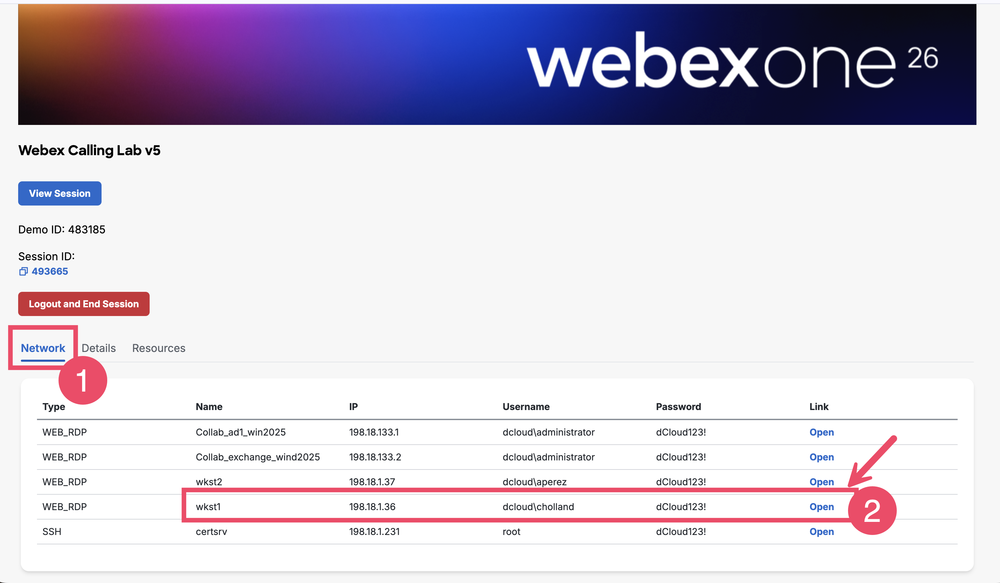
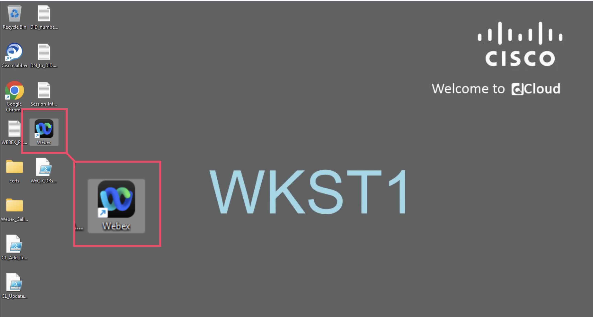
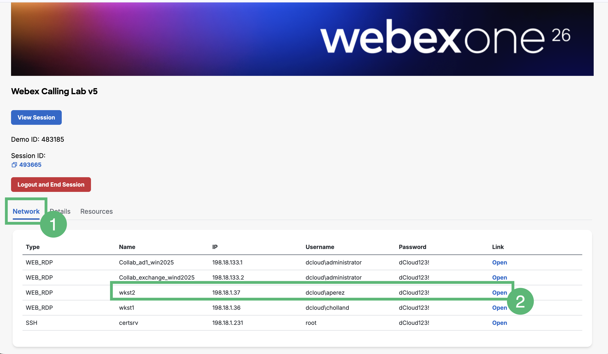
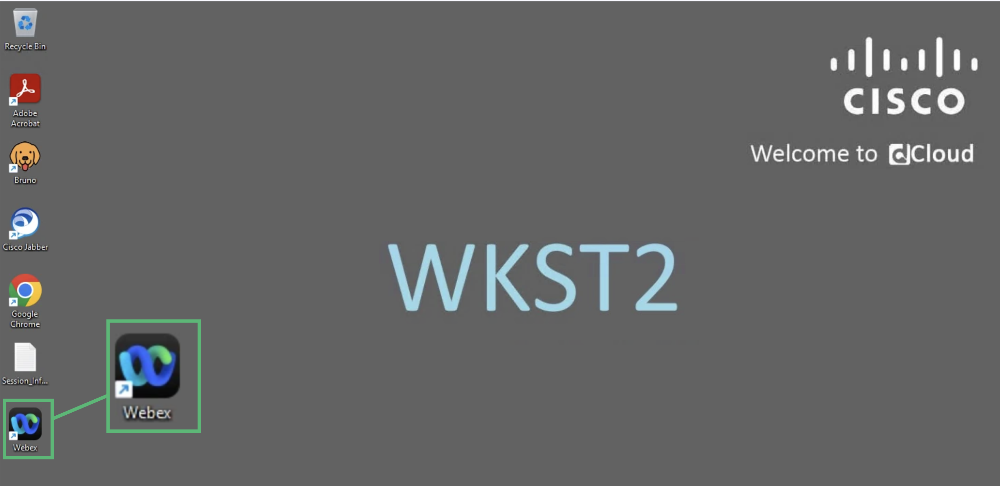

# Lab 8: Test Call Routing and Features

In this lab, you will login in Webex as Charles Holland and Taylor Bard to use the Supervisor Customer Assist experience, as well as the Agent Customer Assist experience.

Go back to the <a href="https://www.ciscodcloud.com/apps/expo/852doanwwzjba2ixk1e1q8rvh/" target="_blank" rel="noopener">dCloud Session View</a>

Click on images to enlarge.

**1. Open Workstation 1**

{ width=65% }

- In the Network section find wkst1
  - Click the link to open

{ width=65% }

- Click on the Webex App and log in as Charles Holland
    - Same log in as you used for Collaboration Control Hub
    - Example: cholland@cb375.dc-05.com, dCloud1234!

**2. Open Workstation 2**

{ width=65% }

- Go back to the session view tab
- In the Network section find wkst2
   - Click the link to open

{ width=65% }

- Log in as Taylor Bard with the same domain and password as Charles Holland
  - Example: tbard@cb375.dc-05.com, dCloud1234!

You should now have 2 browser tabs open. Each with the appropriate user logged into the Webex App.

**3. Call the main number and test routing options.**

**Test the Reservations queue**

- Call the main number using your mobile phone
    - Select 1 for Reservations
- On Workstation 2, in the Webex app, answer the call as Taylor Bard
- End the call from your mobile phone
- In the Webex app, set the wrap-up reason to Booking

**Test Guest Services**

- Call the main number
  - Select 2 for Guest Services
- Listen for the additional prompt and the Guest Services greeting.
- End the call from your mobile phone

**4. Test the supervisor experience.**

**Start a monitored call**

- Call the main number
  - Select 1 for Reservations
- On Workstation 2, in the Webex app, answer the call as Taylor Bard
- From your mobile phone, say several phrases
  - See that the transcript content is generated
- DO NOT END THE CALL

**Monitor and control the call**

- On Workstation 1, in the Webex App, open the Customer Assist Supervisor view
- Go to Agent > Monitoring and select Taylor Bard
- In Actions, select Monitor
- While monitoring, test Whisper Coach, Barge In, and Pause
- DO NOT END THE CALL

**Test transcripts and finish the call**

- On Workstation 2
  - While the call is open, test the transcript and closed-caption options as Taylor in the Webex App
  - Continue speaking as the customer so the agent has content to review.
- End the call from your mobile phone
- In the Webex App, set a wrap-up reason after the call finishes

**Review dashboards and queue status**

- In Workstation 1, review the real-time and historical dashboards as Charles Holland.
- In Workstation 2, sign in as Taylor and unjoin the Reservations Queue.
- In Workstation 1, select Taylor and select Join to add Taylor back to the queue.
- Test other options, such as signing out and changing the agent state.

**5. Test the administrator experience.**

Go back to your browser tab with <a href="http://admin.webex.com/" target="_blank" rel="noopener">Collaboration Control Hub</a>.

**Review queue recordings**

- Go to **Services > Customer Assist > Recordings**.
- Filter by location and choose Palmora Resort.

**Review analytics**

- Go to **Monitoring > Analytics > Customer Assist**.

**Help Article Links**

* [Supervisor experience in Webex App](https://help.webex.com/en-us/article/nc8142w/Get-started-with-Webex-Calling-Customer-Assist-for-Supervisors)
* [Agent experience in Webex App](https://help.webex.com/en-us/article/n15c125/Get-started-with-Webex-Calling-Customer-Assist-for-Agents)

!!! danger "STOP: End of Lab 8"
    Wait for instructions before proceeding.
