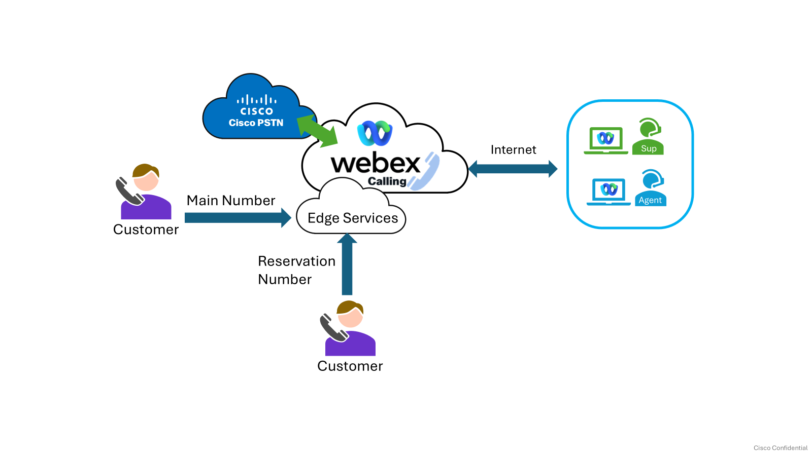
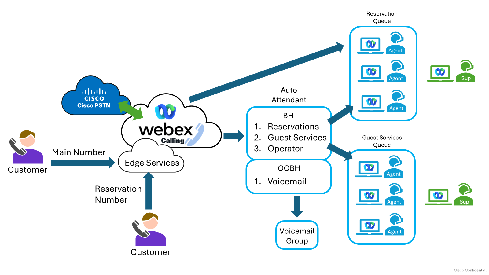

# Lab overview & objectives

This hands-on lab offers practical experience in configuring and deploying a foundational voice-only call center type environment using Webex Calling Customer Assist. Participants will actively set up an auto attendant, intelligent call routing, and queue management. The lab transitions theoretical knowledge to practical applications, enabling attendees to optimize call handling, enhance customer experience, and improve agent productivity. Upon completion, participants will be skilled in implementing a professional, streamlined voice contact solution within their Webex Calling environment.

**Lab objectives**

1. Assign the Customer Assist licenses to users.
2. Create Customer Assists queues.
3. Learn about the supervisor and agent experience with Customer Assist.

### Example customer scenario

Palmora Resort needs a solution that serves as both a calling and a light call center solution. This solution should facilitate call handling and provide easy and visual ways for supervisors to monitor agents.

### Basic Customer Information

Customer Name: Palmora Resort

Location: Miami, Florida

Business Verticals: Hospitality

About: Palmora Resort is a tropical vacation retreat offering stylish accommodations, relaxing amenities, and memorable island-inspired experiences. Guests can book and reserve to enjoy beautiful surroundings, personalized service, dining, wellness activities, and curated adventures—all designed for a peaceful and effortless escape.

### Connectivity Requirements

Basic Connectivity Image

### Users

|  |  |  |  |
| --- | --- | --- | --- |
| Department | Agents | Supervisors | Total |
| Reservations | 3 | 1 |  |
| Concierge | 3 | 0 |  |
| Totals | 6 | 1 | 7 |

### Call Flows

### Additional information

* + Agents receive calls based on who has been idle the most
  + Supervisor monitors calls from the Webex app
